# PebloNotes

PebloNotes is a full-stack MERN note-taking SaaS app for children, students, and general learners. It combines a friendly notebook-style writing workspace with authentication, searchable notes, Gemini-powered study summaries, public read-only sharing, PDF export, productivity insights, and learning reminders.

The project is built as a full-stack developer assignment with a React/Vite frontend, an Express/MongoDB backend, JWT-based authentication, email OTP verification, and a polished responsive UI.

## Live Demo

- Frontend: `https://peblonotes.onrender.com/`
- Backend API: `https://peblo-notes-j9ze.onrender.com`

## GitHub Repository

- Repository: `https://github.com/Rhythm82/Peblo-Notes.git`

Use the provided `.env.example` files as templates.

## Feature Overview

### Authentication

- Signup with name, email, and password
- Email OTP verification before account access
- Login and logout
- JWT authentication using httpOnly cookies and bearer token support
- Protected frontend routes for dashboard, notes, note editor, and note reader
- Frontend auth context for session state
- Password validation for length, letter, number, and symbol
- Password hashing with bcrypt

### Notes Workspace

- Create, edit, read, archive, and delete notes
- Search notes by title, content, plain text, and tags
- Organize notes by category
- Organize notes with tags
- Category tabs and archived notes toggle
- Note cards with title, category, tags, preview, updated date, and quick actions
- Dedicated note reader page
- Dedicated note editor page

### Rich Note Editor

- Title, category, and tag fields
- Editable rich content area using `contentEditable`
- Bold formatting
- Text highlighting
- Larger text formatting
- Bullet and numbered list formatting
- Image insertion into notes
- Simple square/circle shape insertion
- Save and cancel editing flow
- AI title suggestion from note content for existing notes

### Reading Experience

- Clean reading page for each note
- Eye protection warm reading mode
- Edit, archive, delete, share, and PDF actions from the reader
- AI summary section below the note
- Smooth AI loading card while a summary is being generated

### AI Integration

- Gemini API integration through the backend only
- AI-generated study summary
- Detailed summary list
- Key points
- Action items
- Suggested title
- Difficulty badge
- Quick revision text
- Regenerate summary support
- AI response stored in MongoDB on the note document
- Backend keeps `GEMINI_API_KEY` away from the frontend

### PDF Export

- Download private notes as PDF
- Download public shared notes as PDF when public settings allow it
- PDF includes original note content
- PDF includes AI summary data when available
- Export layout excludes navbar, buttons, and app controls

### Public Sharing

- Generate a public share link for a note
- Shared notes are accessible without login
- Public page is read-only
- Disable public share links
- Disabled links return an expired/no-longer-public state
- Invalid links return a public error page
- Public page does not expose edit, archive, or delete actions
- Share view count and last-viewed timestamp are tracked

### Dashboard And Productivity

- Productivity insights dashboard
- Total notes count
- Recently edited notes count
- AI summaries count
- Active public links count
- Archived notes count
- Recently edited notes list
- Most-used tags
- Weekly activity chart for created, edited, and AI-generated activity
- Latest AI note preview
- Learning calendar
- Create reminders for selected dates
- Attach reminders to notes
- Mark reminders done/reopen
- Delete reminders
- Today's reminder popover

### UI/UX

- Responsive layout for mobile, tablet, and desktop
- Dark/light mode with persisted theme preference
- Liquid glassmorphism styling
- Notebook/paper-inspired landing page
- Child-friendly copy, spacing, and visual design
- Smooth animations with Framer Motion
- Polished navbar with mobile menu

## Extra Features Beyond Basic Requirements

- Email OTP verification
- Eye protection reading mode
- PDF export
- Public share link generation and disable flow
- Rich note formatting and image insertion
- AI title suggestion
- Productivity dashboard with chart visualization
- Learning calendar and reminders
- Dark/light mode
- Public read-only note pages

## Tech Stack

### Frontend

- React 19
- Vite
- React Router
- Tailwind CSS v4
- Axios
- Framer Motion
- Recharts
- Lucide React icons
- html2pdf.js

### Backend

- Node.js
- Express 5
- MongoDB with Mongoose
- JWT authentication
- bcrypt password hashing
- Nodemailer OTP emails
- Google Gemini API through `@google/genai`
- cookie-parser
- CORS
- dotenv

## Libraries And Packages Used

### Frontend Packages

- `@tailwindcss/vite`
- `axios`
- `framer-motion`
- `html2pdf.js`
- `lucide-react`
- `react`
- `react-dom`
- `react-router-dom`
- `recharts`
- `tailwindcss`
- `vite`
- `eslint`

### Backend Packages

- `@google/genai`
- `bcrypt`
- `cookie-parser`
- `cors`
- `dotenv`
- `express`
- `jsonwebtoken`
- `mongoose`
- `nodemailer`
- `nodemon`

## Folder Structure

```text
PebloNotes/
├── backend/
│   ├── src/
│   │   ├── config/
│   │   │   └── db.js
│   │   ├── controllers/
│   │   │   ├── authController.js
│   │   │   ├── dashboardController.js
│   │   │   ├── noteController.js
│   │   │   ├── reminderController.js
│   │   │   └── sharedController.js
│   │   ├── middleware/
│   │   │   └── authMiddleware.js
│   │   ├── models/
│   │   │   ├── Note.js
│   │   │   ├── Reminder.js
│   │   │   └── User.js
│   │   ├── routes/
│   │   │   ├── authRoutes.js
│   │   │   ├── dashboardRoutes.js
│   │   │   ├── noteRoutes.js
│   │   │   ├── reminderRoutes.js
│   │   │   └── sharedRoutes.js
│   │   ├── utils/
│   │   │   ├── geminiClient.js
│   │   │   ├── generateOtp.js
│   │   │   ├── generateShareId.js
│   │   │   └── sendEmail.js
│   │   └── server.js
│   ├── .env.example
│   └── package.json
├── frontend/
│   ├── public/
│   ├── src/
│   │   ├── assets/
│   │   ├── components/
│   │   │   ├── Navbar.jsx
│   │   │   ├── ProtectedRoute.jsx
│   │   │   └── ThemeToggle.jsx
│   │   ├── context/
│   │   │   ├── AuthContext.jsx
│   │   │   └── ThemeContext.jsx
│   │   ├── pages/
│   │   │   ├── Dashboard.jsx
│   │   │   ├── Landing.jsx
│   │   │   ├── Login.jsx
│   │   │   ├── NoteEditor.jsx
│   │   │   ├── NoteReader.jsx
│   │   │   ├── Notes.jsx
│   │   │   ├── SharedNote.jsx
│   │   │   ├── Signup.jsx
│   │   │   └── VerifyOtp.jsx
│   │   ├── services/
│   │   ├── utils/
│   │   │   └── exportNotePdf.js
│   │   ├── App.jsx
│   │   ├── index.css
│   │   └── main.jsx
│   ├── .env.example
│   └── package.json
├── projectScreenShort/
└── README.md
```

## Architecture

PebloNotes uses a classic MERN architecture. The React frontend handles routing, protected screens, UI state, PDF export, and API calls. Axios sends authenticated requests to the Express backend. The backend validates requests, protects private routes, talks to MongoDB through Mongoose, sends OTP emails through Nodemailer, and calls Gemini for AI summaries.

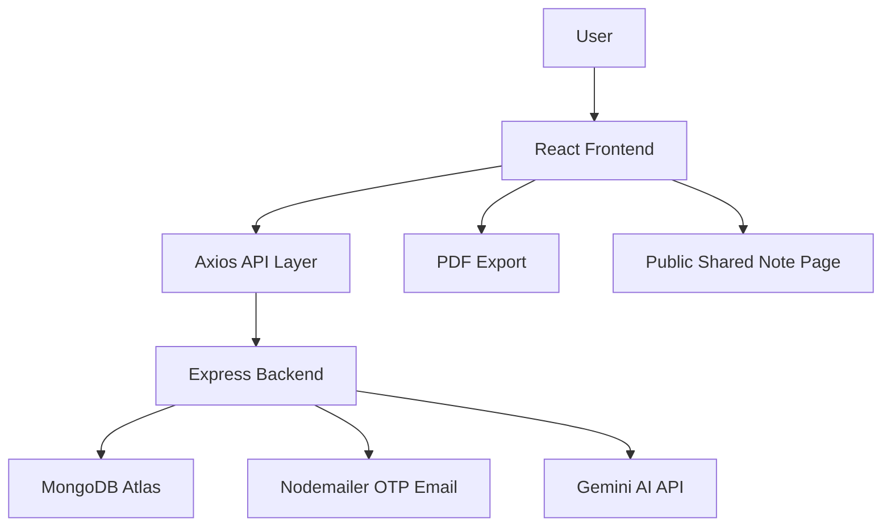

## App Flow

1. A visitor lands on the notebook-inspired landing page.
2. The user signs up and verifies their email with OTP.
3. After verification/login, the user enters the dashboard.
4. The user creates notes from the notes workspace or dashboard.
5. Notes can be edited with rich text, tags, category, images, and formatting.
6. The note reader shows the clean reading view, AI tools, sharing tools, archive/delete actions, and PDF export.
7. Dashboard insights update based on notes, AI usage, public links, tags, reminders, and activity.

## User Authentication Flow

1. User submits name, email, and password on `/signup`.
2. Backend validates the email and password rules.
3. Backend hashes the password with bcrypt.
4. Backend creates a six-digit OTP, stores only the hashed OTP, and sends the OTP email using Nodemailer.
5. User submits email and OTP on `/verify-otp`.
6. Backend compares the OTP with the stored hash and checks expiry.
7. Backend marks the user as verified, clears OTP fields, signs a JWT, and sets an auth cookie.
8. Frontend stores the returned token in localStorage as a fallback and loads the authenticated user through `/api/auth/me`.
9. Protected routes use `AuthContext` and `ProtectedRoute` to prevent unauthenticated access.

## Notes Workspace Flow

1. `/notes` loads the user's non-deleted notes from `/api/notes`.
2. Search and category filters are sent as query parameters.
3. The archived toggle switches between active and archived notes.
4. The workspace renders note cards with category, title, preview, tags, updated date, and actions.
5. Users can create a note at `/notes/new`, edit at `/notes/:id/edit`, or read at `/notes/:id`.
6. Archive toggles note visibility without deleting it.
7. Delete permanently removes the note document from MongoDB.

## AI Summary Flow

1. The user opens a note reader and clicks Generate AI Summary.
2. Frontend calls `POST /api/notes/:id/generate-summary`.
3. Backend confirms the note belongs to the logged-in user.
4. Backend strips note content to study text and sends a structured prompt to Gemini.
5. Gemini returns JSON with summary, detailed summary, key points, action items, suggested title, difficulty, and quick revision.
6. Backend stores the AI response on the note document.
7. Frontend displays the AI study card and allows regeneration.
8. Users can apply the suggested title to the note.

## Public Share Flow

1. The user opens the share dialog from the note reader.
2. Frontend checks current share status with `GET /api/notes/:id/share/status`.
3. User can generate a public link with `POST /api/notes/:id/share`.
4. Backend creates a share ID if needed and marks the note as public.
5. Anyone with `/shared/:shareId` can read the note without logging in.
6. The public page is read-only and does not expose edit/delete/archive controls.
7. The owner can disable the public link with `PATCH /api/notes/:id/share/disable`.
8. Disabled links return an expired/no-longer-public message.

## Dashboard And Productivity Flow

1. `/dashboard` calls `/api/dashboard/insights`.
2. Backend aggregates note counts, archived count, AI usage, public link count, recent notes, most-used tags, latest AI note, reminders, and weekly activity.
3. Frontend displays stat cards, a weekly Recharts bar chart, recently edited notes, tag usage, AI insight preview, and a learning calendar.
4. Reminder APIs support adding date-based learning tasks, attaching them to notes, marking them done/reopened, and deleting them.
5. Today's reminder popover shows open tasks for the current day.

## PDF Export Flow

1. The user clicks Download PDF on a private note or allowed public note.
2. Frontend builds a clean hidden HTML document for the PDF.
3. The PDF includes note title, category, tags, last updated date, original content, and AI summary if available.
4. `html2pdf.js` exports the generated document as an A4 PDF.
5. Navigation, buttons, dialogs, and other UI controls are not included.

## Responsive And Child-Friendly UI

- The landing page uses a notebook/paper-inspired background and friendly visual cards.
- Main app pages use glass panels, soft borders, bright but readable accents, and rounded controls.
- The dashboard, notes grid, editor, reader, and public page adjust for small and large screens.
- Dark mode is available through the navbar and persists in localStorage.
- Eye protection mode changes the reader into a warmer color palette for easier reading.
- Icons are used throughout the UI to make actions easier to recognize.

## Screenshots

### Landing Page
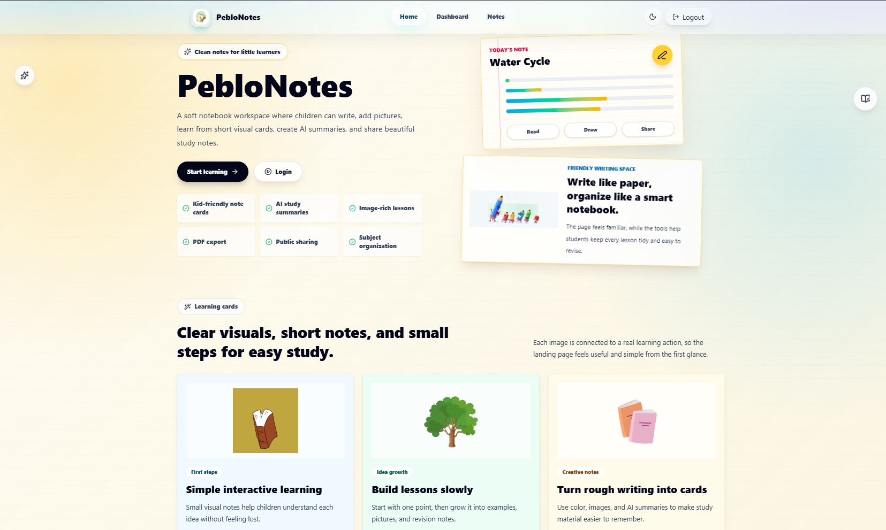

### Dashboard Overview
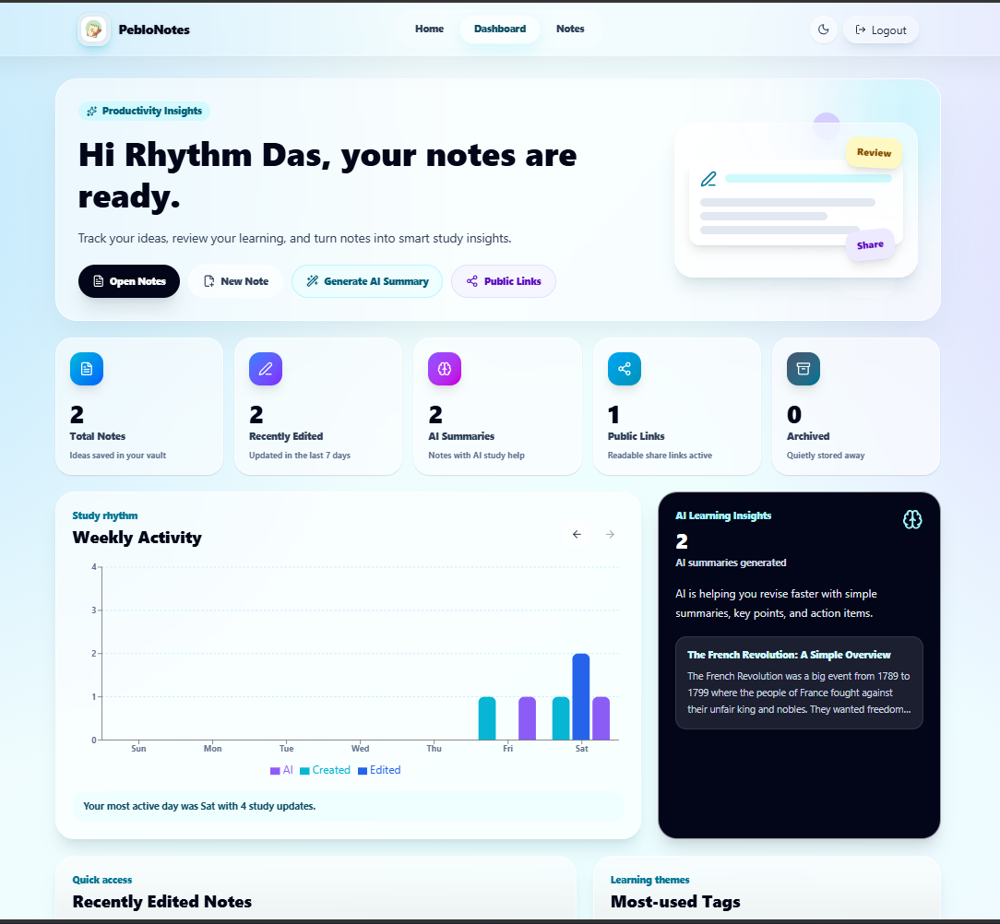

### Dashboard Calendar And Insights
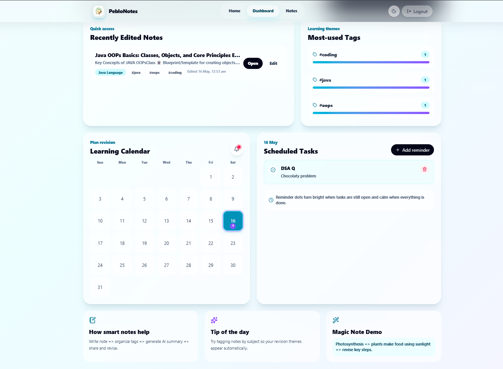

### Notes Workspace
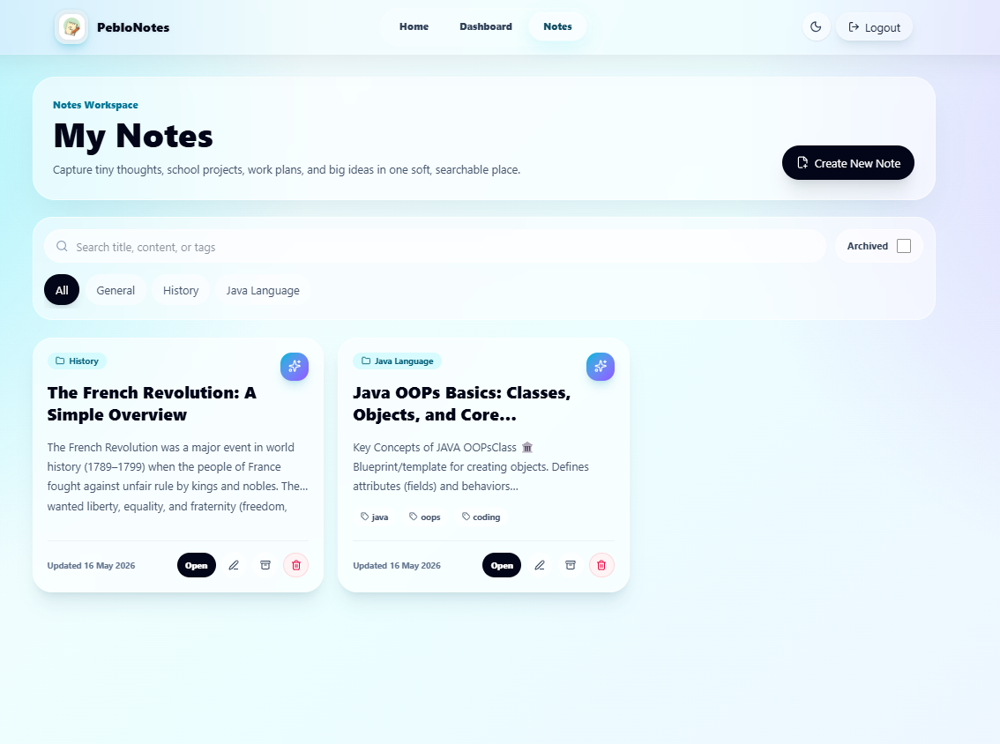

### Note Workspace Detail
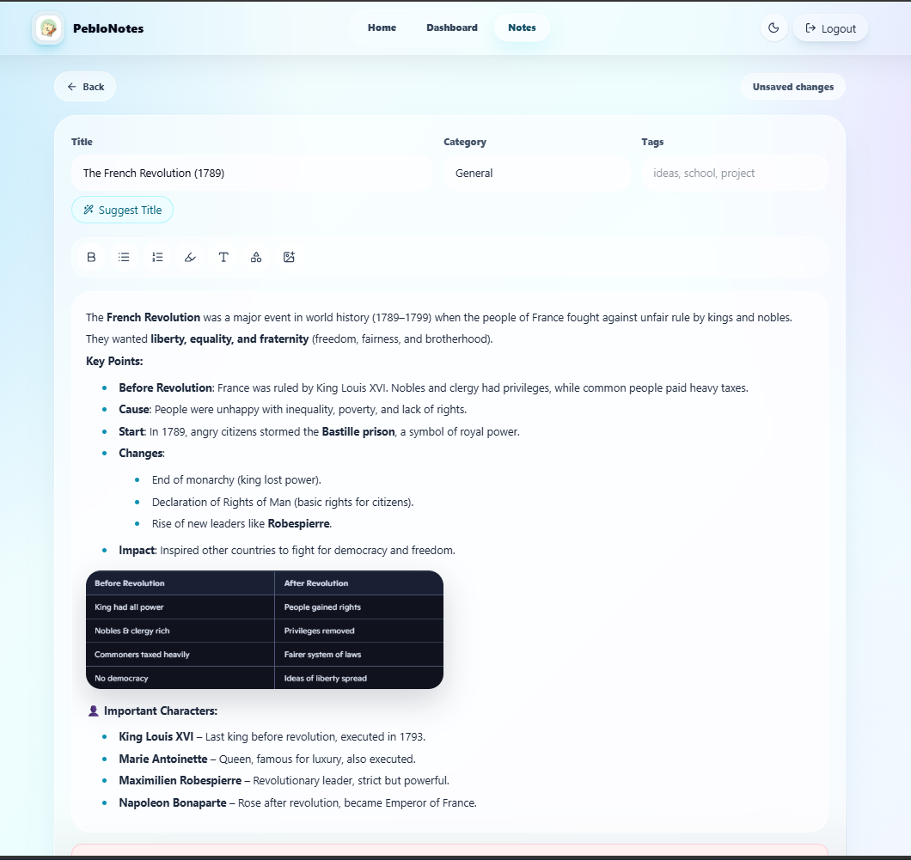

### AI Summary
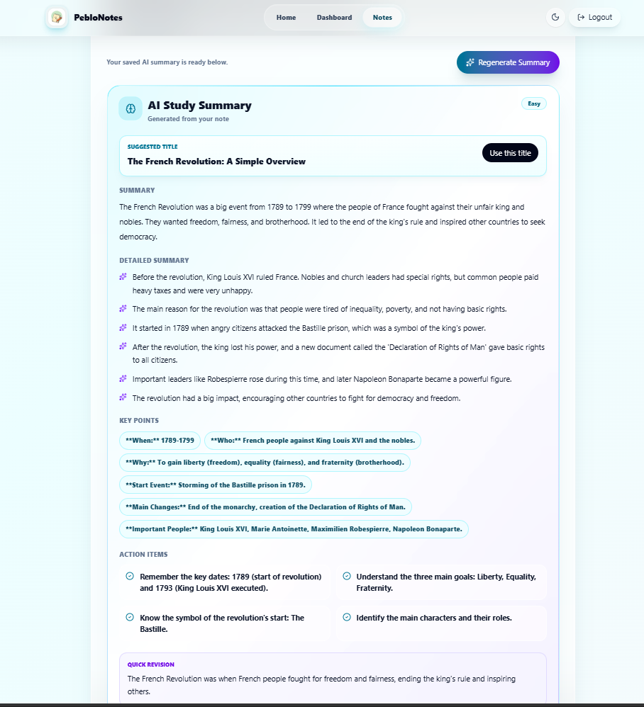

### Share Dialog
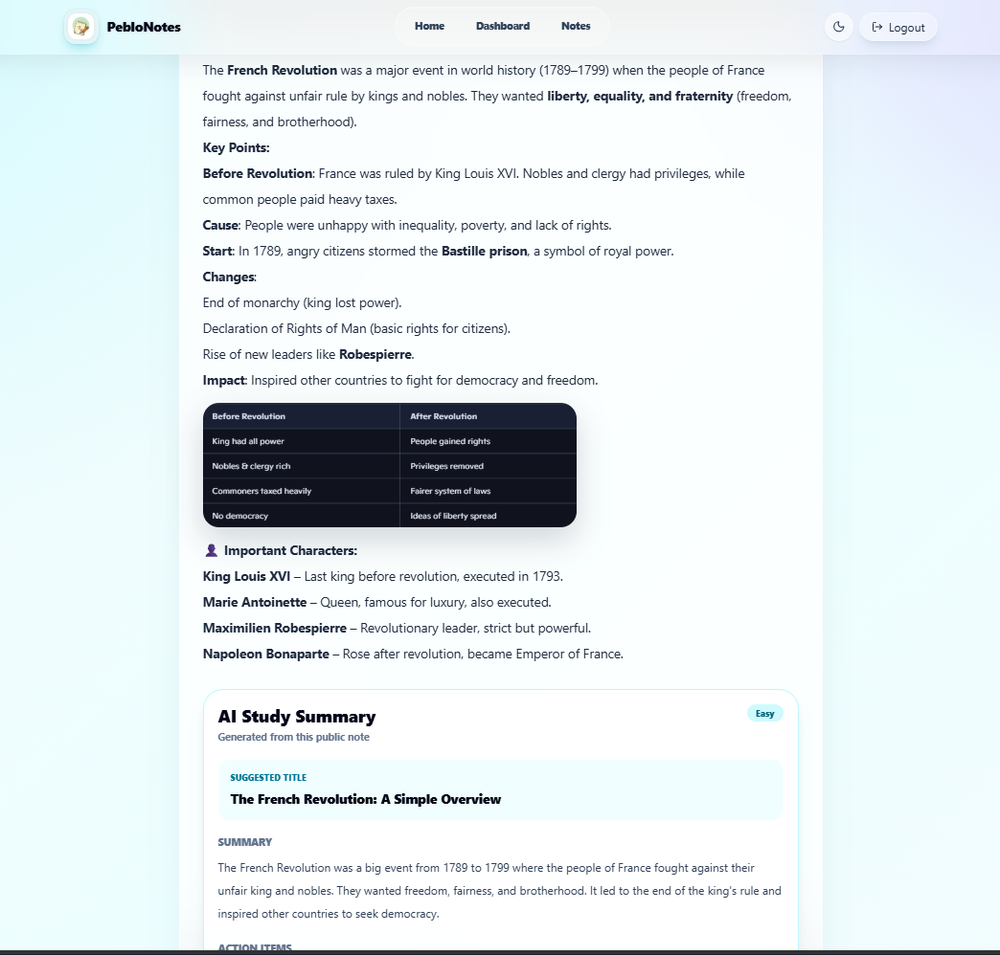

### Public Share Link
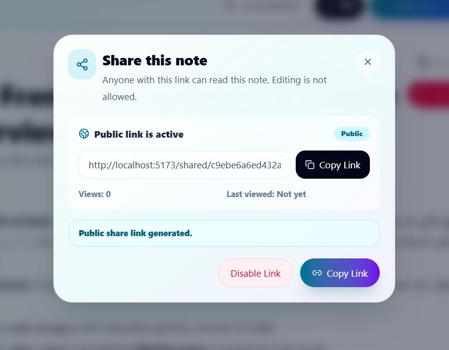

### Eye Protection Reading Mode
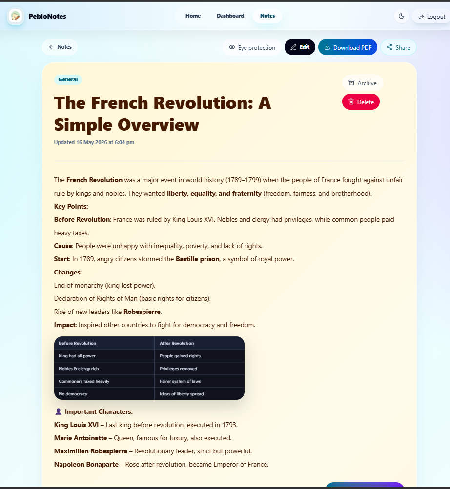

### Dark Mode
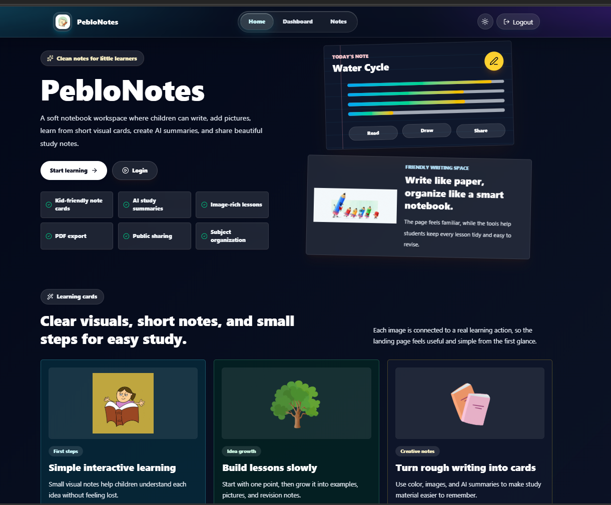

## Environment Variables

### Backend

Create `backend/.env` from `backend/.env.example`:

```env
PORT=5000
NODE_ENV=development
MONGO_URI=mongodb://127.0.0.1:27017/peblonotes
JWT_SECRET=replace_with_a_long_random_secret
JWT_EXPIRES_IN=7d
EMAIL_USER=your_email@gmail.com
EMAIL_PASS=your_gmail_app_password
CLIENT_URL=http://localhost:5173,http://127.0.0.1:5173
GEMINI_API_KEY=
GEMINI_MODEL=gemini-2.5-flash
```

### Frontend

Create `frontend/.env` from `frontend/.env.example`:

```env
VITE_API_URL=http://localhost:5000/api
```

## Setup Instructions

### Prerequisites

- Node.js
- npm
- MongoDB connection string, either local MongoDB or MongoDB Atlas
- Gmail/app password or SMTP-compatible email credentials for OTP emails
- Gemini API key for AI summaries

### Install Backend

```bash
cd backend
npm install
```

### Install Frontend

```bash
cd frontend
npm install
```

## Run The Application

Open two terminals.

### Terminal 1: Backend

```bash
cd backend
npm run dev
```

Backend runs on:

```text
http://localhost:5000
```

Health check:

```text
http://localhost:5000/health
```

### Terminal 2: Frontend

```bash
cd frontend
npm run dev
```

Frontend runs on:

```text
http://localhost:5173
```

## How To Test The Application

There are no automated test scripts currently configured. Use these checks for assignment review:

1. Run the backend with `npm run dev` inside `backend`.
2. Run the frontend with `npm run dev` inside `frontend`.
3. Open `http://localhost:5173`.
4. Sign up with a valid email and verify the OTP.
5. Login and confirm protected routes work.
6. Create a note with title, category, tags, formatted content, and an image.
7. Search/filter notes from the notes workspace.
8. Open a note and test eye protection mode.
9. Generate or regenerate an AI summary.
10. Download the note as PDF.
11. Generate a public share link and open it in a private/incognito window.
12. Disable the public link and confirm the public page shows an expired state.
13. Add a learning reminder from the dashboard calendar.
14. Mark the reminder done/reopen it, then delete it.

Frontend validation commands:

```bash
cd frontend
npm run lint
npm run build
```

Backend production start check:

```bash
cd backend
npm start
```

## API Routes Overview

### Health

| Method | Route | Access | Description |
| --- | --- | --- | --- |
| GET | `/health` | Public | Backend health check |
| GET | `/api` | Public | API info message |

### Auth Routes

| Method | Route | Access | Description |
| --- | --- | --- | --- |
| POST | `/api/auth/signup` | Public | Create account and send OTP |
| POST | `/api/auth/verify-otp` | Public | Verify OTP and start session |
| POST | `/api/auth/login` | Public | Login verified user |
| POST | `/api/auth/logout` | Public | Clear auth cookie |
| GET | `/api/auth/me` | Protected | Return current user |

### Note Routes

| Method | Route | Access | Description |
| --- | --- | --- | --- |
| GET | `/api/notes` | Protected | List user's notes with search/category/tag/archive filters |
| GET | `/api/notes/categories` | Protected | Get note categories with counts |
| POST | `/api/notes` | Protected | Create note |
| GET | `/api/notes/:id` | Protected | Get one owned note |
| PATCH | `/api/notes/:id` | Protected | Update note |
| PATCH | `/api/notes/:id/archive` | Protected | Toggle archive state |
| DELETE | `/api/notes/:id` | Protected | Delete note |
| POST | `/api/notes/:id/generate-summary` | Protected | Generate Gemini AI summary |
| POST | `/api/notes/:id/share` | Protected | Generate/enable public share link |
| GET | `/api/notes/:id/share/status` | Protected | Get public share status |
| PATCH | `/api/notes/:id/share/disable` | Protected | Disable public share link |

### Shared Note Routes

| Method | Route | Access | Description |
| --- | --- | --- | --- |
| GET | `/api/shared/:shareId` | Public | Get public read-only note |

### Dashboard Routes

| Method | Route | Access | Description |
| --- | --- | --- | --- |
| GET | `/api/dashboard/insights` | Protected | Dashboard stats, recent notes, tags, activity, reminders |
| GET | `/api/dashboard/activity` | Protected | Weekly activity data |

### Reminder Routes

| Method | Route | Access | Description |
| --- | --- | --- | --- |
| GET | `/api/reminders?month=YYYY-MM` | Protected | Get reminders for a month |
| GET | `/api/reminders/today` | Protected | Get today's reminders |
| POST | `/api/reminders` | Protected | Create reminder |
| PATCH | `/api/reminders/:id` | Protected | Update reminder |
| PATCH | `/api/reminders/:id/done` | Protected | Toggle done state |
| DELETE | `/api/reminders/:id` | Protected | Delete reminder |

## Database Models Overview

### User

Stores account and verification data:

- `name`
- `email`
- `password` hashed and excluded by default
- `isVerified`
- `otpHash` excluded by default
- `otpExpiresAt` excluded by default
- timestamps

### Note

Stores note content, organization, AI data, and sharing data:

- `user`
- `title`
- `content`
- `plainText`
- `category`
- `tags`
- `isArchived`
- `isDeleted`
- `editorData`
- `canvasData`
- `attachments`
- `aiSummary`
- `aiActionItems`
- `aiSuggestedTitle`
- `aiData.detailedSummary`
- `aiData.keyPoints`
- `aiData.difficulty`
- `aiData.quickRevision`
- `aiData.generatedAt`
- `shareId`
- `isPublic`
- `shareCreatedAt`
- `shareDisabledAt`
- `shareViews`
- `lastSharedViewedAt`
- `shareSettings`
- `scheduledDate`
- `scheduleText`
- `collaborators`
- `lastEditedAt`
- timestamps

### Reminder

Stores learning calendar tasks:

- `user`
- `note`
- `title`
- `description`
- `scheduledDate`
- `isDone`
- `color`
- timestamps

## Security Notes

- Passwords are hashed with bcrypt before storage.
- OTP values are hashed before storage and expire after 10 minutes.
- JWTs are signed with `JWT_SECRET`.
- Auth cookie is httpOnly and uses secure/sameSite production settings.
- Protected backend routes use auth middleware.
- Frontend API requests include credentials and bearer token fallback.
- CORS is restricted to configured client origins.
- User password, OTP hash, and OTP expiry are excluded from default user queries.
- Public shared notes are read-only and only available when `isPublic` is true.
- Gemini API key is used only on the backend.
- HTML content is sanitized in the frontend before saving/displaying/exporting to reduce unsafe markup risk.

## Known Limitations

- No automated test suite is configured yet.
- No password reset flow is implemented.
- No email resend OTP endpoint is implemented; expired OTP requires signing up again.
- Rich text editing uses browser `document.execCommand`, which is older browser API behavior.
- Inserted images are embedded into note HTML instead of uploaded to cloud storage.
- Delete currently removes the note document instead of using the `isDeleted` soft-delete field.
- Public share settings exist in the model, but the current UI focuses on enabling/disabling the link.
- Collaboration fields exist in the note model, but collaborative editing is not implemented in the UI.

## Future Improvements

- Add automated unit, integration, and end-to-end tests.
- Add password reset and OTP resend flows.
- Move note images to cloud storage such as Cloudinary or S3.
- Replace `document.execCommand` with a modern rich text editor engine.
- Add public share settings controls for AI visibility and PDF download.
- Add soft delete/trash recovery.
- Add real-time collaboration.
- Add pagination for large note collections.
- Add backend rate limiting for auth and AI endpoints.
- Add deployment configuration examples.

## Submission Checklist

- README rewritten with actual project structure and features
- Frontend and backend package files inspected
- Routes, controllers, models, services, pages, and utilities inspected
- `.env.example` values documented without exposing credentials
- Screenshots linked using real files from `projectScreenShort`
- Setup and run instructions included for frontend and backend
- API routes documented
- Database models documented
- Security notes, limitations, and future improvements included
